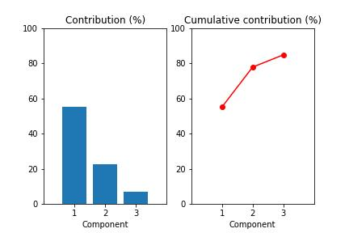
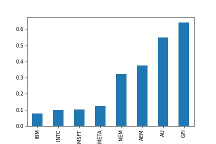
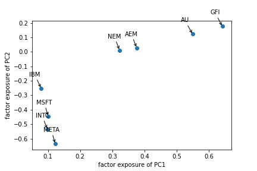

# Isolate alpha with principal component analysis (PCA)

I’m going to show you how to use principal component analysis (PCA) to analyze a portfolio of stocks.

**PCA:**
https://en.wikipedia.org/wiki/Principal_component_analysis

PCA is used widely in data science. It’s a way to reduce the number of dimensions in a data set. In a stock portfolio, a dimension might be a column of returns for one of the stocks. In a portfolio of 100 stocks, there are 100 dimensions. PCA converts those 100 dimensions into the few that explain the most variance in the data. In other words, the dimensions hold the most information about the data.

**Quants use PCA in many ways**
PCA isolates the statistical return drivers of a portfolio. These drivers are called “alpha factors” (or just factors) because they create returns that are not explained by a benchmark. (In a previous newsletter issue, you learned how to hedge beta to get exposure to alpha.) Quants use factors in trading strategies. First, they isolate the components. Then they buy the stocks with the largest exposure to a factor and sell the stocks with the smallest exposure to a factor.

Key Takeaways:

- Get stock data

- Fit a PCA model

- Visualize the components

- Isolate the alpha factors

---

import required libraries:

- yfinance

- pandas

- numpy

- sklearn

- matplotlib

---

**File:** [Isolate Alpha PCA](IsolateAlpha-PCA.ipynb)
**FAANG File:** [Isolate FAANG Alpha PCA](IsolateAlpha-PCA-FAANG.ipynb)

---

## Step 1: Get the data

Build a portfolio, pick any stocks you want.

For this example the following will be used:

    'IBM',

    'MSFT',
    
    'META',
    
    'INTC',
    
    'NEM',
    
    'AU',
    
    'AEM',
    
    'GFI'
    

Use the yFinance library to get data

For this example we will work with the adjusted closing price using the built in pct_change() function to calculate the returns.

---

## Step 2: Fit a PCA model
sklearn makes it easy to fit a PCA model and get the components.

The n_components argument tells sklearn how many of the top components to return. 

Fit the model with the portfolio returns and the algorithm will look for the top three components that explain most of the variance in the returns.

After the model is fit, grab the explained variance and components (remember the underscore).

---

## Step 3: Visualize the components
If the description of PCA is unclear, these charts should help.

**Contribution (%) and Cumulative contribution (%)**

**The chart on the left** shows the contribution of the top three components toward the total variance. In other words, these components contribute the most to the information in the data. The first component explains 54.9% of the variation in the portfolio returns. In stock portfolios, this is usually driven by the overall market movement.

**The chart on the right** is the cumulative sum of the contribution of each component. It shows the top three components explain 84.7% of total portfolio returns. There’s no magic cumulative contribution but two or three components explaining close to 85% of the contribution is a good result.

---

## Step 4: Isolate the alpha factors
There are forces that move stock prices that we can’t see. These latent factors are picked up through PCA and isolated as the principal components. The overall stock market is usually a strong driver of returns. Macroeconomic forces like interest rates and the pandemic drive returns, too. PCA lets you isolate these statistical factors to get an idea of how much the portfolio’s returns come from these unobserved features.

- Muliply the portfolio returns by the principle components. 
- The dot function makes sure every return is multiplied by each of the components. 
- the T function transposes the DataFrame. 
- The resulting DataFrame gives you how much of that day’s portfolio return is a result of each of the three factors.

Similar stocks will be driven by similar factors. PCA makes it easy to visualize this.

**factor exposures bar plot**

Analyze the first component. Create a DataFrame with the components, grab the first factor, sort stocks by the component, and plot them. You can see the tech stocks and the gold stocks clustered together. This component is more strongly driving the gold stocks. Can you guess what it is? (Hint: What major global event took place between January 2020 through November 2022?)

**Visualize this with a scatter plot.**

You can see how the stocks are driven by the first two principal components. Gold stocks were largely driven by factor one and tech stocks were negatively driven by factor two.

This analysis covered the time period during covid. Gold stocks were bid up strongly as a hedge against inflation and uncertainty. You might consider the first factor as a “covid factor” representing uncertainty across the market. Tech stocks crashed as worries of economic health began.
